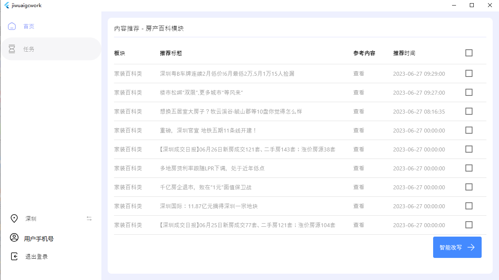

# 简介

> LLM写作系统


> 基于openai-gpt的能力，对文章进行批量化改写

# 快速开始

### 一.运行环境

支持Linux、Windows系统，Mac系统未测试。

先安装 `Python`
> 建议Python版本3.8.x，尤其是需要进行exe打包时（3.8为win7上可运行的最后一个python版本）。

创建虚拟环境后，安装所需核心依赖：

```bash
python -m pip install --upgrade pip
pip install -r requirements.txt
```

### 二.相关配置
```bash
# config.json文件内容示例
{
  "milvus": {  # milvus链接方式
    "debug": {
      "host": "xxx",
      "port": 19530,
      "user": "xxx",
      "passwd": "xxx"
    },
    "production": {
      "host": "xxx",
      "port": 19530,
      "user": "xxx",
      "passwd": "xxx"
    }
  },
  "mysql": {  # mysql链接方式
    "debug": {
      "user": "xxx",
      "password": "xxx",
      "host": "xxx",
      "port": 3306,
      "database": "easy_writing",
      "charset": "utf8mb4"
    },
    "production": {
      "user": "xxx",
      "password": "xxx",
      "host": "xxx",
      "port": 3306,
      "database": "easy_writing",
      "charset": "utf8mb4"
    }
  },
  "openai": {  # openai链接方式
    "open_ai_proxy": {
      "enable": true,
      "api_base": "https://xxx/v1",
      "api_key": "xxx"
    },
    "api_key": "sk-xxx",
    "open_ai_chat_model": "gpt-3.5-turbo",
    "open_ai_embedding_model": "text-embedding-ada-002",
    "openai_retry": {
      "min_wait": 3,
      "max_wait": 5,
      "max_attempt_number": 3
    },
    "open_ai_system_prompt": [
      {
        "role": "system",
        "content": "你是个乐于助人的助手。"
      }
  ],
    "persist_session": false,
    "tokens_use_per_article": 7000
  },
  "local_proxy": {
    "enable": true,
    "host": "127.0.0.1",
    "port": 10809,
    "port_socket": 10808
  },
  "redis": {  # redis链接方式
    "debug": {
      "host": "127.0.0.1",
      "port": 6379,
      "db": 10,
      "password": "xxx"
    },
    "production": {
      "host": "xxx",
      "port": 6379,
      "db": 10,
      "password": "xxx"
    }
  },
  "tencent": {  # 腾讯云账户，发送短信相关
    "sms": {
      "SECRET_ID" : "xxxxx",
      "SECRET_KEY" : "xxxxx",
      "SDK_APP_ID" : "xxxxx",
      "SIGN_NAME" : "xxxxx",
      "TEMPLATE_ID" : "xxxxx",
      "VERIFICATION_CODE_EXPIRE_MINUTES" : 5,  # 验证码过期时间（分钟）
      "VERIFICATION_CODE_SEND_FREQUENCY" : 1   # 验证码发送频率限制（分钟）
    }
  },
  "access_token": {
    "SECRET_KEY" : "xxxxx",  # 秘钥
    "RSA_PRIVATE_KEY" : "xxxxx",  # 秘钥
    "ALGORITHM" : "xxx",  # JWT令牌签名算法
    "EXPIRE_SECONDS" : 8640000  # 访问令牌过期时间
  },
  "encrypt": {
    "SECRET_KEY_AES": "xxx"
  }
}
```

### 三.运行
**本地运行，** 直接在项目根目录下执行：
```bash
python main.py
```
**线上（极简模式）：** 
```bash
fastapi接口：
nohup python main.py >> ./out.log 2>&1 & echo $! > ./pidfile

gradio测试接口：
nohup python app/app.py >> ./out.log 2>&1 & echo $! > ./pidfile
```
### 四.运行结果示例



